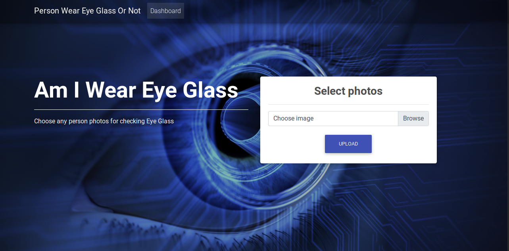
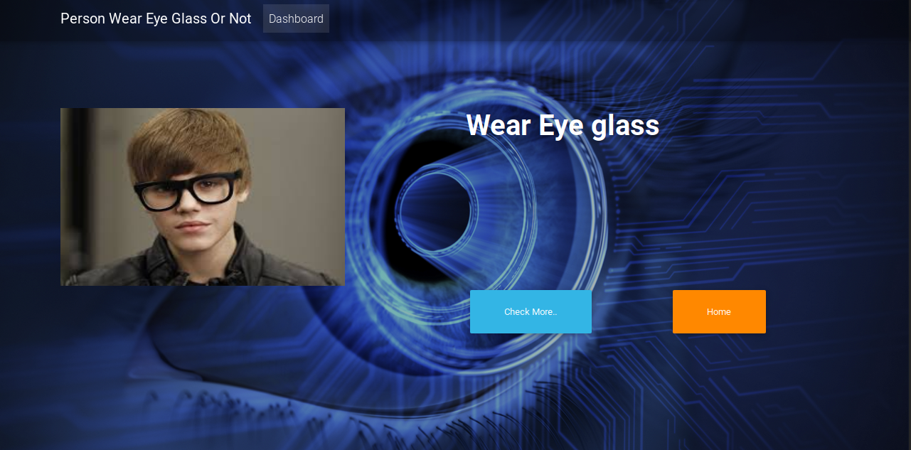
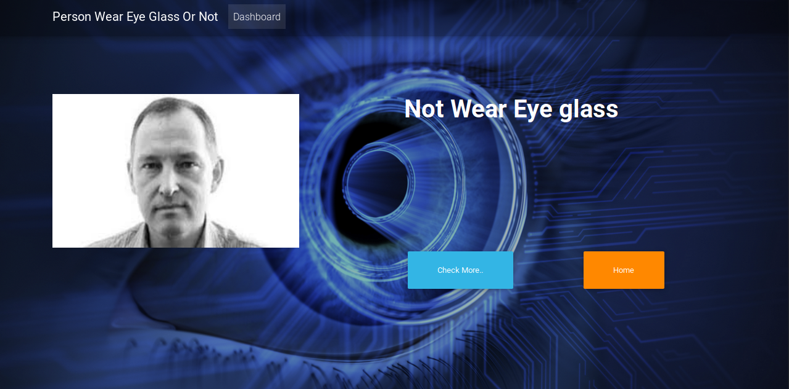

# django_wearglass
This is a project for creating a webb app that can classify whether person in images wear eye glass or not.

### Requirements
####  For Web app

1. Python.
2. Keras with tensorflow backend.
3. Django

####  For Training and customization 
With the above requirements,

1. Numpy
2. Pandas
3. Scikit-Learn
4. Matplotlib
5. Jupyter Notebook

### Installation

#### For running the web app.

1. Clone this repository
2. Go to django_wearglass/djwearglass/
3. Run 'python3 manage.py runserver'
4. Go to `http://127.0.0.1:8000/` in your browser.

### Results

